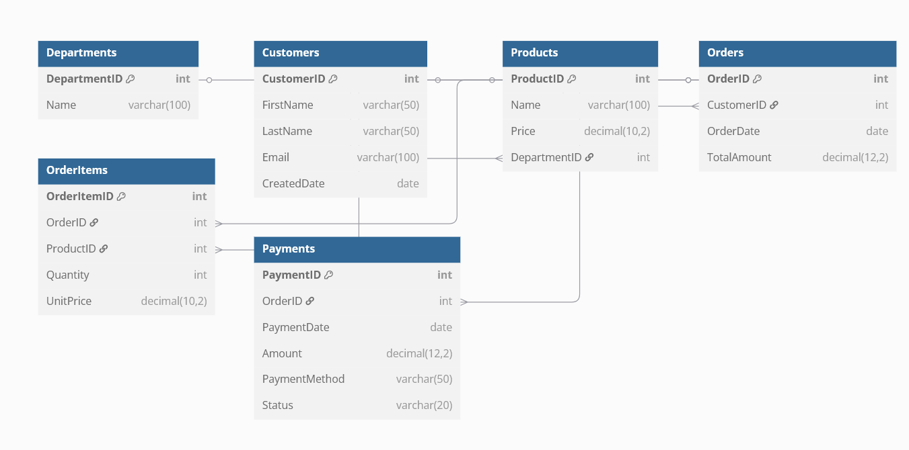

# 💼 Euna Solutions Tech Stack Project Showcase

---

## 📊 1. SQL + SSRS Reporting Project

**Tech Stack:** SQL Server, SSRS (via Visual Studio)

**Features:**  
- Custom SQL Database Schema
  
  - SQL code for Table Creation, Data Population and Custom Views Provided
- SSRS reports including:
  - Completed Orders (Totals)
    
    - **Order Fulfillment and Inventory Managers** can check the completed orders, highlighting any potential issues in fulfillment

  - Orders By Categories
  
    - **Department Managers and Sales Teams** can track the performance of different departments, identifying high-performing areas and those needing improvemen
---

## 🔄 2. ETL Simulation with SQL

**Tech Stack:** SQL Server

**Project Description:**  
Simulates a basic ETL pipeline using CSV data and SQL for transformation.

**Features:**  
- Extract: Load CSV data (via Python or SQL Server import)
- Transform: Clean and normalize the data
- Load: Insert into structured final tables

---

## 🖥️ 3. Mini Web App with C# + SQL

**Tech Stack:** C#, ASP.NET, SQL Server

**Project Description:**  
A simple budgeting web app that allows users to input, store, and retrieve budget data.

**Features:**  
- User input forms
- SQL-based data storage and queries
- Basic analytics or chart views

---

## 📈 4. Power BI Dashboard

**Tech Stack:** Power BI, SQL Server

**Project Description:**  
Interactive dashboard built using SQL data connected to Power BI.

**Features:**  
- Real-time insights
- Slicers for filtering
- KPIs and summary metrics
- Time-based trend visuals
