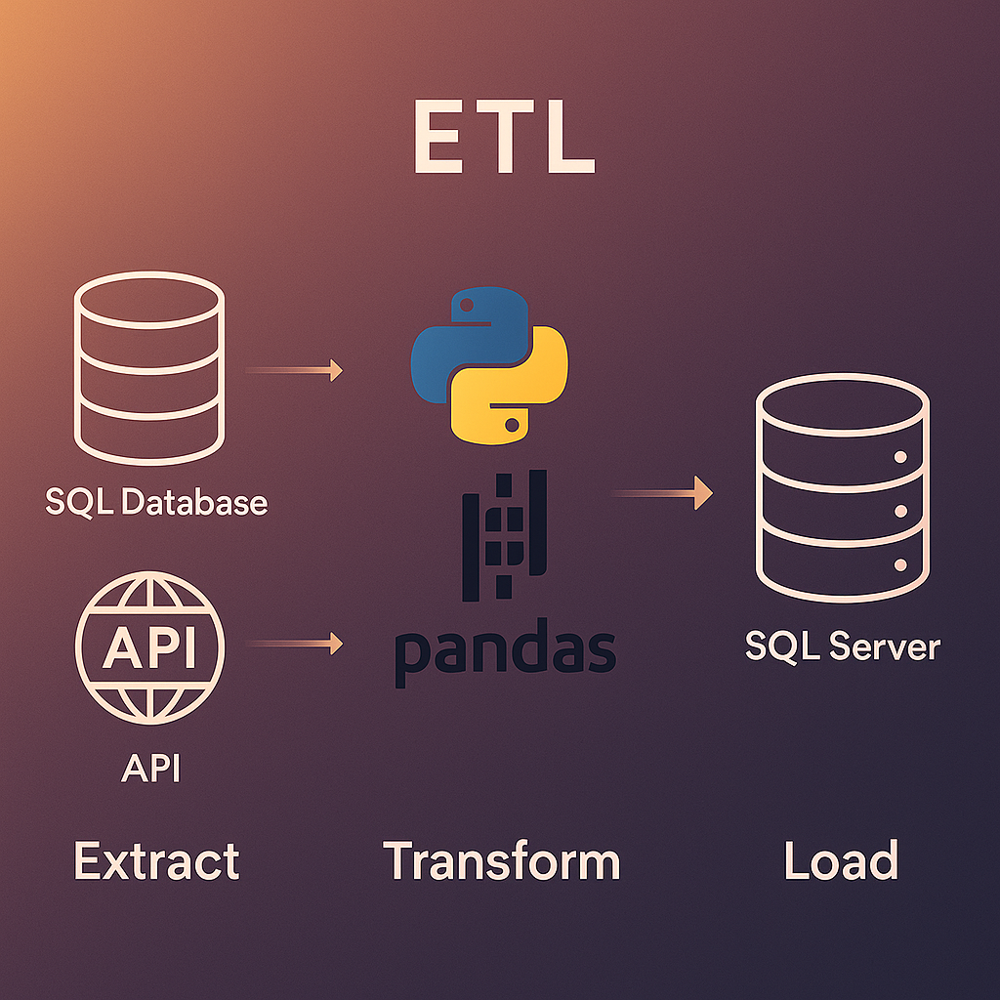

# 💼 Euna Solutions Tech Stack Project Showcase
Showcasing the various technologies outlined in the Associate Technical Solutions Specialist Position

**Outline**
  1. SQL + Reporting Project (SQL, SSMS, SSRS, Visual Studio)
  2. ETL (Python, SQL, API, Kaggle Datasets)
  3. Desktop CRUD Application (C#, .NET)
  4. PowerBI Dashboard (PowerBI)

---

## 📊 1. SQL + SSRS Reporting Project
Building SQL Database, populating data, and creating reports using SSRS

**Technologies:** SQL Server (SSMS), SSRS (via Visual Studio)

**Custom SQL Database Schema**

   
  
  SQL code for Table Creation, Data Population and Custom Views Provided

**Completed Orders (Totals) Report**

**Order Fulfillment and Inventory Managers** can check the completed orders, highlighting any potential issues in fulfillment.

**Orders By Categories**

**Department Managers and Sales Teams** can track the performance of different departments, identifying high-performing areas and those needing improvement.

    

---

## 🔄 2. ETL Simulation with SQL
Simulates a basic ETL Pipeline application, combining data from various sources, applying some data cleaning and quality checks before loading the data into an SQL Database.

[Kaggle Dataset](https://www.kaggle.com/datasets/datascientistanna/customers-dataset)

[Dummy User Data JSON](https://dummyjson.com)

## ETL Script Overview

- **Extracts** customer, product, order, and payment data from a local SQL Server database.
- **Extracts** additional customer details from a CSV file (`Shop Customer Data.csv`).
- **Extracts** public user data from a dummy API (`https://dummyjson.com/users`).
- **Transforms** the API JSON response into a flattened pandas DataFrame. **Standardizes** all column names to lowercase for consistency.
- **Merges** all datasets together using DataFrame index alignment.
- **Outputs** a cleaned and merged customer DataFrame ready for analysis
- **Loads** the DataFrame into an SQL Server Database

**Before vs After**

  
  

---

## 🖥️ 3. C# .NET + SQL

**Tech Stack:** C#, ASP.NET, SQL Server
A simple app that allows users to input, store, and retrieve Customer data from the database.

**Features:**  
- User input forms
- SQL-based data storage and queries

  
  

---

## 📈 4. Power BI Dashboard

**Tech Stack:** Power BI, SQL Server

**Project Description:**  
Interactive dashboard built using SQL data connected to Power BI.

**Features:**  
- Real-time insights
- Slicers for filtering
- KPIs and summary metrics

  

